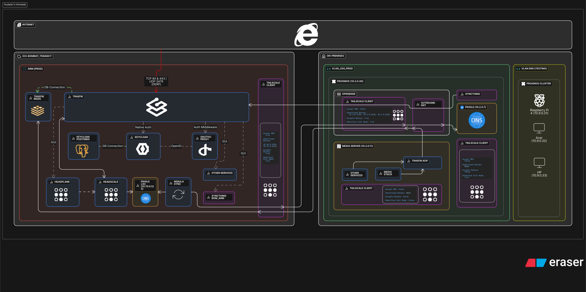

### Hi 👋, I'm [Harshit Mani Tripathi](https://hudater.dev)

#### Wannabe DevOps Engineer and a k8s fearing student

## My Multi-Tenancy Homelab architecture, do take a look :)

## Socials:

# I have practical experience with:

## Languages & Frameworks

## Infrastructure, Automation and Deployment

## Networking, OS and Security

## Cloud Platforms

## Monitoring and Observability

## Databases

## Dev Tools

# 📊 GitHub Stats:

 
 

