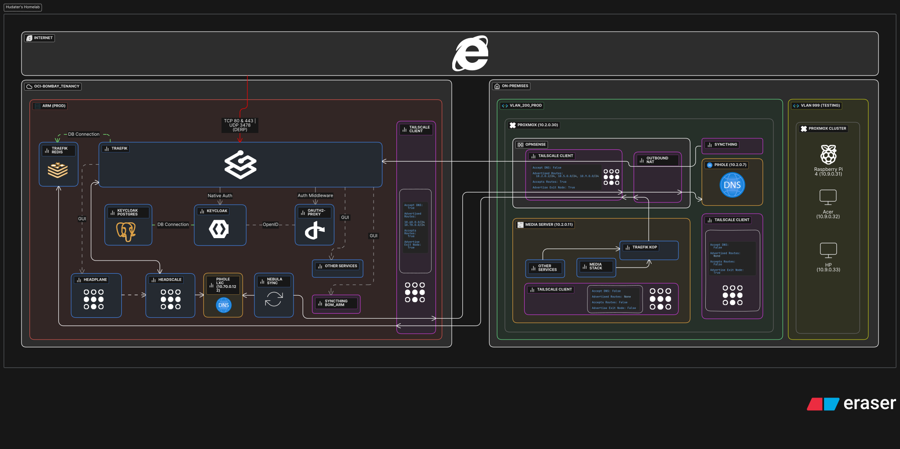

### Hi 👋, I'm [Harshit Mani Tripathi](https://hudater.dev)

#### DevOps-focused CS student building hybrid infrastructure platforms (Proxmox + Oracle Cloud)

Operating a **self-hosted hybrid infrastructure platform** combining on-prem compute and cloud services.

Infrastructure currently handles **[~500k DNS queries with ~40 ms median recursive resolution latency](https://www.linkedin.com/posts/hudater_devops-sre-observability-activity-7434925064304803840-8Hh3)** across self-hosted recursive resolvers and multiple services across private and public networks.

<!-- **Currently seeking DevOps / SRE internship opportunities.** -->
**Currently DevOps Intern @Unstop**

---

# Hybrid Infrastructure Platform

Hybrid platform integrating **on-prem virtualization** with **cloud networking and automation**.

Core capabilities:

- Proxmox virtualization platform
- Infrastructure provisioning via **OpenTofu / Terraform**
- Configuration management using **Ansible**
- Multi-tenant ingress using **Traefik**
- Identity and authentication with **Keycloak + OpenID**
- DNS stack using **Unbound**
- Private networking via **WireGuard + Tailscale**
- Observability stack with **Prometheus, Loki and Grafana**

Full architecture breakdown and diagrams → https://blog.hudater.dev/posts/homelab/

---

# Key Projects

### Hybrid Infrastructure Platform

Self-hosted hybrid cloud platform combining **Proxmox homelab and Oracle Cloud**.

Features:

- Infrastructure as Code provisioning
- Automated DNS management
- Identity-based service authentication
- Reverse proxy ingress platform
- Centralized monitoring and logging

Read more → <https://blog.hudater.dev/posts/homelab/>

---

# Socials

---

# Technologies I Work With

## Infrastructure & Automation

---

## Containers & Runtime

---

## Networking & Platform

---

## Cloud

---

## Observability

---

# GitHub Stats

